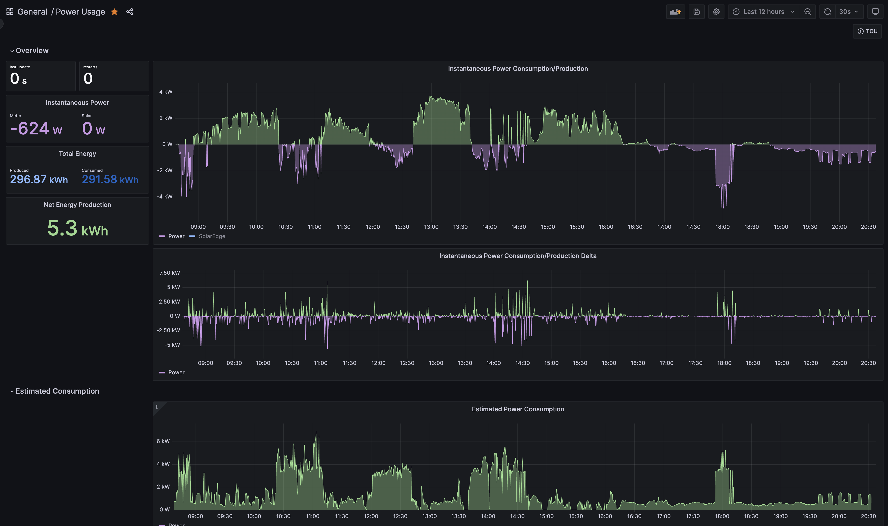
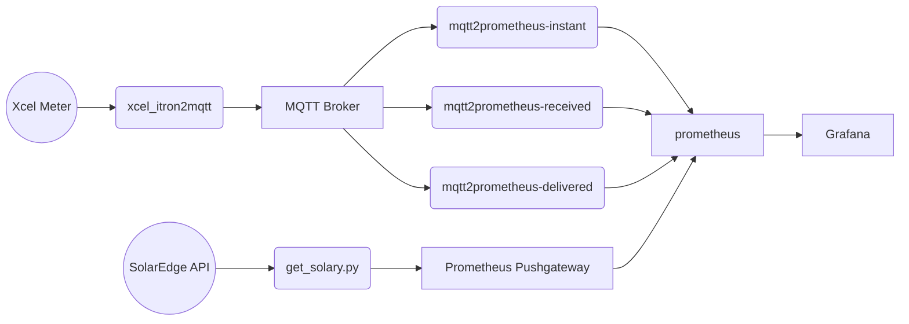
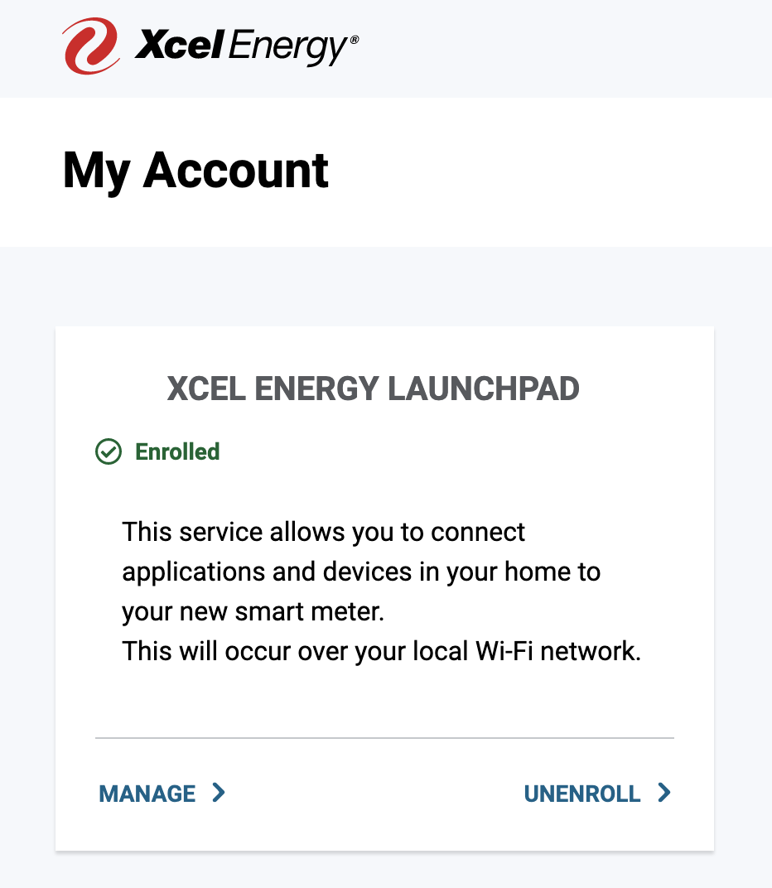
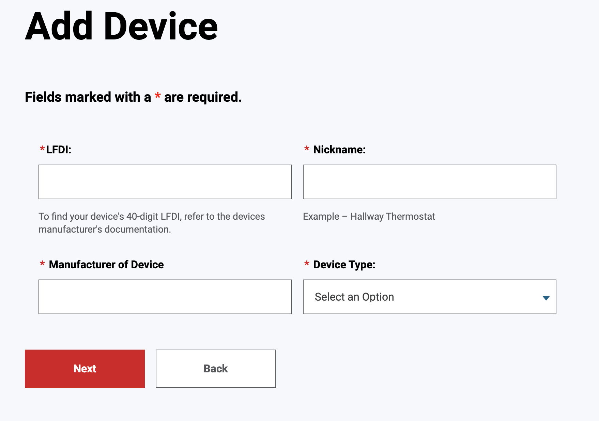

# Connect an Xcel iTron Meter to Prometheus via MQTT

This project leverages the work done by [zaknye/xcel_itron2mqtt](https://github.com/zaknye/xcel_itron2mqtt) to connect to an Xcel iTron smart meter, send the output to an MQTT Broker, read the output using [hikhvar/mqtt2prometheus](https://github.com/hikhvar/mqtt2prometheus) and then output the results to a Prometheus time series database instance so it can be viewed in Grafana.

This docker compose file launches several different components:

- [xcel-itron2mqtt](https://github.com/zaknye/xcel_itron2mqtt) - This queries the Xcel meter every 5 seconds and posts the data to an MQTT Message Broker
- [mosquitto](https://mosquitto.org/) - a simple MQTT message broker for connection to Homeassistant
- [mqtt2prometheus](https://github.com/hikhvar/mqtt2prometheus) - a bridge between an MQTT topic and Prometheus
- [Prometheus](https://prometheus.io/) - a time series database
  - Alertmanager - part of Prometheus to allow alerting based on certain queries
  - Pushgateway - part of Prometheus to allow pushing data (as opposed to polling)
- [Grafana](https://grafana.com/) - a visualization tool to build and view dashboards based on Prometheus (and other data source) data

Data from the xcel smart meter is sent to MQTT, then eventually ends up in Prometheus, where it can be visualized in Grafana in whatever form makes the most sense to you.
Ultimately, the results of this project can produce something that looks like this:



## But why?

I'm a huge fan of Prometheus/Grafana to analyze stuff - so as with many things in life, if you have a hammer, everything looks like a nail. There were existing projects that did the hard work of connecting to an Xcel Smart Meter, so I just glued them together rather than re-invent the wheel. [This class xkcd comic](https://xkcd.com/1988/) sums it up pretty well:


## How does it work?

Here's a rough flow diagram of all the piece-parts contained in this project. This is mostly a set of configuration files and docker-compose files to achieve the following



Note: the `get_solar.py` portion isn't ready for prime time yet - but it's coming soon.

This project assumes that you have `docker` and `docker-compose` installed and is currently only compatible with `x86` based hardware (no ARM/Raspberry Pi - at least not yet - which is for the best since Prometheus is really hard to cram onto a Raspberry Pi).

## Clone this repo

```bash
git clone https://github.com/brianthedavis/xcel-prometheus-monitor.git
```

...or download it from the `Code` button up top.

## Connect to the meter

In general, follow the instructions that are outlined at <https://github.com/zaknye/xcel_itron2mqtt> to establish a connection
between your Xcel iTron Gen5 Riva meter.  Start by generating a set of TLS certificates to securely communicate with the meter.  This command executes the `generate_keys.sh` script from the [zaknye/xcel_itron2mqtt GitHub repo](https://github.com/zaknye/xcel_itron2mqtt).

*Note -- this section will likely change as Xcel modifies their website over time...you may have to do some off-roading here*

1. Run this command from the location where this repo is cloned

    ```bash
    curl -s https://raw.githubusercontent.com/zaknye/xcel_itron2mqtt/main/scripts/generate_keys.sh | bash -s
    ```

    and will create a `certs` directory and output a string like:

    ```
    The following string of numbers should be used as your LFDI value on the Xcel website:
    69B39A3106A6D6B213AC1E265B15D57795571169
    ```

2. Open the [Xcel Energy website](https://my.xcelenergy.com/MyAccount/s/meters-and-devices/manage-meters-and-devices)
) and select `Edit Meters and Devices`
3. *The details of how to enroll in the Xcel Energy Launchpad are missing here...*
4. Once Enrolled in the Xcel Energy Launchpad, select the `Manage` button

    

5. If you haven't already, connect the meter to your WiFi using the `Edit` button.
   - I've successfully connected mine on a different (untrusted) WiFi network than my trusted network (separated via VLANs and different SSIDs) - your mileage may vary
6. Select `Add a Device` and enter the LFDI that was provided from the `generate_keys.sh` script before.

    

    For all of the other options, you can provide whatever value makes sense to you; the only important part is the LF

7. Once your WiFi is connected and you've added a device, you will need to wait ~1 week for Xcel to confirm your Launchpad Enrollment.  You'll receive an email confirming this (again - this take a week or more). See the notes below under [Testing Connectivity](#testing-connectivity-to-the-meter) for tips on verifying a connection.

## Configuring the stack parameters

Create an `.env` file (that won't get committed to the repo) which has all of shared variables.

> Note: this will store the MQTT password in plain text, so this isn't the most secure solution. You can always store this file in your home directory with tighter permissions or use something like docker secrets if you want to secure this more.

Copy `.env_template` to  `.env` and edit the values to match your configuration.  Here's an example:

```
MQTT_SERVER=localhost
MQTT_USER=xcel_itron2mqtt
MQTT_PASSWORD=abcdefghijklmonpqrstufwxyz
METER_IP=xcel-itron.local
METER_PORT=8081
```

### Configure mosquitto mqtt user

> If you already have an MQTT Broker, then these steps can be skipped and the `mosquitto` service can be removed from the docker-compose.yml file

Create a user and password for the `xcel-itron2mqtt` utility to connect to the `mosquitto` broker by running the following command (using the `MQTT_PASSWORD` value defined in the `.env` file):

```bash
source .env && \
docker run --rm -it -v \
    $(pwd)/mosquitto:/mosquitto_config \
    eclipse-mosquitto:2 \
    /usr/bin/mosquitto_passwd -c -b /mosquitto_config/password_file \
    ${MQTT_USER} ${MQTT_PASSWORD}
```

This will create `./mosquitto/password_file` which we'll pass to the mosquitto mqtt container later.

## Running

Once the configuration is complete, run the following command from this directory

```
docker-compose up
```

You should see a set of containers being pulled via docker and launched, eventually resulting in a stream of log messages indicating that each of the containers is up and running.  Watch the log messages to see if any container is regularly restarting.  Alternatively, you can launch with the command

```
docker-compose up -d
```

which will launch the containers in the background, then periodically run

```
docker-compose ps
```

which should show an output like

```
                          Name                                        Command               State                       Ports
--------------------------------------------------------------------------------------------------------------------------------------------------
alertmanager                                               /bin/alertmanager --config ...   Up      0.0.0.0:9093->9093/tcp
grafana                                                    /run.sh                          Up      0.0.0.0:3000->3000/tcp
mosquitto                                                  /docker-entrypoint.sh /usr ...   Up      0.0.0.0:1883->1883/tcp, 0.0.0.0:9001->9001/tcp
prometheus                                                 /bin/prometheus --config.f ...   Up      0.0.0.0:9090->9090/tcp
pushgateway                                                /bin/pushgateway                 Up      0.0.0.0:9091->9091/tcp
xcel-itron2mqtt                                            /opt/xcel_itron2mqtt/run.sh      Up
xcel-prometheus-monitor_xcel-mqtt2prometheus-delivered_1   /mqtt2prometheus -log-leve ...   Up      0.0.0.0:9643->9643/tcp
xcel-prometheus-monitor_xcel-mqtt2prometheus-instant_1     /mqtt2prometheus -log-leve ...   Up      0.0.0.0:9641->9641/tcp
xcel-prometheus-monitor_xcel-mqtt2prometheus-received_1    /mqtt2prometheus -log-leve ...   Up      0.0.0.0:9642->9642/tcp
```

if any container is regularly restarting, you'll see it listed in the `State` column.

## Use

See the [Using This Project Guide](docs/how_to_use.md)

## Additional Resources

- [Troubleshooting](docs/troubleshooting.md)
- [Testing Connectivity to the Meter](docs/testing_meter_connectivity.md)
- [Discussion Thread in the Home Assistant Forum](https://community.home-assistant.io/t/xcel-energy-itron-gen-5-riva/346943/190)
