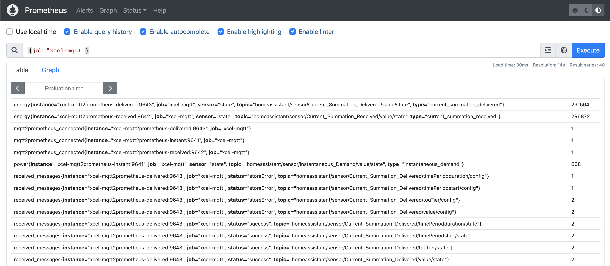

# Using this project

Once started, the following containers are started, exposing the ports indicated

```
                         Name                                        Command               State                       Ports
--------------------------------------------------------------------------------------------------------------------------------------------------
alertmanager                                               /bin/alertmanager --config ...   Up      0.0.0.0:9093->9093/tcp
grafana                                                    /run.sh                          Up      0.0.0.0:3000->3000/tcp
mosquitto                                                  /docker-entrypoint.sh /usr ...   Up      0.0.0.0:1883->1883/tcp, 0.0.0.0:9001->9001/tcp
prometheus                                                 /bin/prometheus --config.f ...   Up      0.0.0.0:9090->9090/tcp
pushgateway                                                /bin/pushgateway                 Up      0.0.0.0:9091->9091/tcp
xcel-itron2mqtt                                            /opt/xcel_itron2mqtt/run.sh      Up
xcel-prometheus-monitor_xcel-mqtt2prometheus-delivered_1   /mqtt2prometheus -log-leve ...   Up      0.0.0.0:9643->9643/tcp
xcel-prometheus-monitor_xcel-mqtt2prometheus-instant_1     /mqtt2prometheus -log-leve ...   Up      0.0.0.0:9641->9641/tcp
xcel-prometheus-monitor_xcel-mqtt2prometheus-received_1    /mqtt2prometheus -log-leve ...   Up      0.0.0.0:9642->9642/tcp
```

`docker-compose` can keep these ports internal to its docker network, however I've chosen to expose them in case you want to query the data via HomeAssistant or any other platform.

As long as this stack is running, the data will be gathered and stored within Prometheus for later query in Grafana.  By default, Prometheus will store 2 weeks worth of data; however this can be changed by modifying this line in the `docker-compose.yml` file:

```
      - '--storage.tsdb.retention.time=2w'
```
to a longer retention period (such as `90d`).

## Accessing Prometheus

Once the docker-compose stack is running, you can access Prometheus at <http://localhost:9090>.  Running a query like [`{job="xcel-mqtt`}](http://localhost:9090/graph?g0.expr=%7Bjob%3D%22xcel-mqtt%22%7D&g0.tab=1&g0.stacked=0&g0.show_exemplars=0&g0.range_input=1h) will show you all of the metrics exposed by the docker compose stack.



## Accessing Grafana

Grafana can be accessed via <http://localhost:3000>. Underneath the `Dashboards` list, open the **Power Usage** dashboard:


